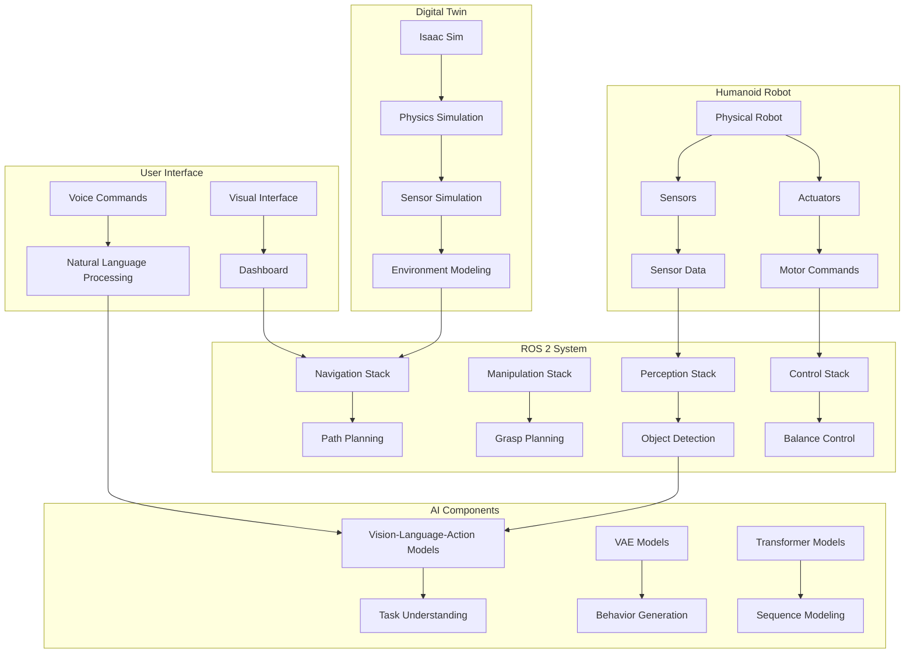

# Module 8: Capstone Project - Complete Humanoid Robotics System

Welcome to the Capstone Project module! This is where you'll integrate all the concepts learned throughout this textbook to build a complete humanoid robotics system. This project will demonstrate your mastery of ROS 2, digital twins, AI perception, VLA models, NVIDIA Isaac, VAE models, humanoid kinematics, and motion planning.

## Learning Objectives

By the end of this module, you will be able to:
- Design and implement a complete humanoid robotics system
- Integrate multiple AI and robotics technologies
- Build a ROS 2-based architecture for humanoid control
- Implement perception-action loops using VLA models
- Create a digital twin for simulation and testing
- Deploy and evaluate your humanoid system

## Prerequisites

- Completion of Modules 1-7
- Understanding of all previous concepts and technologies
- Basic project management and system integration skills
- Familiarity with debugging complex systems

## Table of Contents

1. [Project Overview and Architecture](#project-overview-and-architecture)
2. [System Design and Planning](#system-design-and-planning)
3. [Implementation Phase](#implementation-phase)
4. [Integration and Testing](#integration-and-testing)
5. [Deployment and Evaluation](#deployment-and-evaluation)
6. [Advanced Features and Extensions](#advanced-features-and-extensions)
7. [Project Documentation and Presentation](#project-documentation-and-presentation)

## Project Overview and Architecture

### Project Vision

The capstone project involves creating a complete humanoid robotics system that can:
- Navigate complex environments autonomously
- Manipulate objects using vision-language-action understanding
- Maintain balance and stability during tasks
- Learn from interactions and improve over time
- Respond to natural language commands

### High-Level Architecture



### System Components

1. **Perception System**: Vision, LiDAR, IMU, and other sensors
2. **AI Brain**: VLA models, VAEs, Transformers for understanding
3. **Motion System**: Kinematics, planning, and control
4. **Communication**: ROS 2 middleware for component integration
5. **Simulation**: Digital twin using NVIDIA Isaac
6. **User Interface**: Voice and visual interaction

## System Design and Planning

### Requirements Analysis

#### Functional Requirements
- **Navigation**: Move to specified locations while avoiding obstacles
- **Manipulation**: Pick up and place objects based on commands
- **Interaction**: Respond to voice commands and provide feedback
- **Learning**: Improve performance through experience
- **Safety**: Maintain stability and avoid dangerous situations

#### Non-Functional Requirements
- **Performance**: Execute tasks within 30 seconds of command
- **Reliability**: Operate for 8+ hours without failure
- **Safety**: Maintain balance with 99.9% success rate
- **Scalability**: Support additional tasks without major changes
- **Maintainability**: Modular design for easy updates

### Technology Stack Integration

```python
# System architecture overview
class HumanoidRobotSystem:
    def __init__(self):
        # Core ROS 2 components
        self.ros_node = self.initialize_ros_node()

        # Perception system
        self.vision_system = VisionSystem()
        self.lidar_system = LidarSystem()
        self.imu_system = IMUSystem()

        # AI components
        self.vla_model = VLA_Model()
        self.vae_model = VAE_Model()
        self.transformer_model = TransformerModel()

        # Motion planning
        self.kinematics = HumanoidKinematics()
        self.motion_planner = MotionPlanner()
        self.controller = HumanoidController()

        # Simulation interface
        self.simulator = IsaacSimInterface()

        # User interface
        self.voice_interface = VoiceInterface()
        self.visual_interface = VisualInterface()

    def initialize_ros_node(self):
        """
        Initialize ROS 2 node with all required interfaces
        """
        import rclpy
        from rclpy.node import Node

        rclpy.init()
        node = Node('humanoid_robot_system')

        # Create publishers and subscribers
        node.create_publisher(MotorCommand, '/motor_commands', 10)
        node.create_subscription(SensorData, '/sensor_data', self.sensor_callback, 10)
        node.create_service(TaskCommand, '/task_command', self.task_command_callback)

        return node

    def sensor_callback(self, msg):
        """
        Handle incoming sensor data
        """
        # Process sensor data through perception pipeline
        processed_data = self.process_sensors(msg)

        # Update internal state
        self.update_state(processed_data)

    def task_command_callback(self, request, response):
        """
        Handle task commands from user
        """
        # Parse command using AI
        task_plan = self.vla_model.parse_command(request.command)

        # Execute task
        success = self.execute_task(task_plan)
        response.success = success

        return response
```

### Component Design

#### Perception Pipeline

```python
class PerceptionPipeline:
    def __init__(self):
        self.vision_processor = VisionProcessor()
        self.lidar_processor = LidarProcessor()
        self.sensor_fusion = SensorFusion()
        self.object_detector = ObjectDetector()

    def process_environment(self, sensor_data):
        """
        Process all sensor data to understand environment
        """
        # Process individual sensor streams
        vision_features = self.vision_processor.extract_features(
            sensor_data.rgb_image, sensor_data.depth_image
        )

        lidar_features = self.lidar_processor.process_point_cloud(
            sensor_data.point_cloud
        )

        imu_data = sensor_data.imu

        # Fuse sensor data
        fused_state = self.sensor_fusion.fuse_data(
            vision_features, lidar_features, imu_data
        )

        # Detect and classify objects
        objects = self.object_detector.detect_objects(fused_state)

        return {
            'objects': objects,
            'environment_map': self.create_environment_map(fused_state),
            'robot_pose': self.estimate_robot_pose(fused_state)
        }

    def create_environment_map(self, fused_data):
        """
        Create occupancy grid or semantic map
        """
        # Implementation using SLAM or other mapping techniques
        pass

    def estimate_robot_pose(self, fused_data):
        """
        Estimate robot position and orientation
        """
        # Use sensor fusion and kinematic model
        pass
```

#### AI Decision Making

```python
class AIDecisionSystem:
    def __init__(self):
        self.vla_model = self.load_vla_model()
        self.vae_model = self.load_vae_model()
        self.transformer = self.load_transformer_model()
        self.behavior_selector = BehaviorSelector()

    def make_decision(self, perception_data, task_context):
        """
        Make high-level decisions based on perception and task
        """
        # Use VLA model to understand task requirements
        task_understanding = self.vla_model.understand_task(
            perception_data['objects'],
            task_context['command'],
            perception_data['environment_map']
        )

        # Generate potential behaviors using VAE
        behavior_candidates = self.vae_model.generate_behaviors(
            task_understanding,
            perception_data['robot_pose']
        )

        # Select best behavior using transformer
        selected_behavior = self.transformer.select_behavior(
            behavior_candidates,
            task_understanding,
            environment_context=perception_data
        )

        return selected_behavior

    def load_vla_model(self):
        """
        Load pre-trained VLA model
        """
        import torch
        model = torch.jit.load('/path/to/pretrained/vla_model.pt')
        return model

    def load_vae_model(self):
        """
        Load pre-trained VAE model for behavior generation
        """
        import torch
        model = torch.jit.load('/path/to/pretrained/vae_model.pt')
        return model

    def load_transformer_model(self):
        """
        Load transformer for decision making
        """
        import torch
        model = torch.jit.load('/path/to/pretrained/transformer_model.pt')
        return model
```

## Implementation Phase

### Core System Implementation

#### Main Control Loop

```python
class HumanoidController:
    def __init__(self):
        self.perception = PerceptionPipeline()
        self.ai_system = AIDecisionSystem()
        self.motion_planner = MotionPlanner()
        self.kinematics = HumanoidKinematics()
        self.low_level_controller = LowLevelController()

        self.current_task = None
        self.robot_state = RobotState()
        self.task_queue = []

    def run_main_loop(self):
        """
        Main control loop for humanoid robot
        """
        rate = 50  # Hz
        timer = self.create_rate(rate)

        while rclpy.ok():
            # 1. Acquire sensor data
            sensor_data = self.acquire_sensor_data()

            # 2. Process perception
            perception_result = self.perception.process_environment(sensor_data)

            # 3. Update internal state
            self.robot_state.update(perception_result)

            # 4. Make decisions
            if self.current_task is None and self.task_queue:
                self.current_task = self.task_queue.pop(0)

            if self.current_task:
                decision = self.ai_system.make_decision(
                    perception_result,
                    self.current_task
                )

                # 5. Plan motion
                trajectory = self.motion_planner.plan(
                    decision['action'],
                    self.robot_state
                )

                # 6. Execute motion
                self.execute_trajectory(trajectory)

                # Check if task is complete
                if self.is_task_complete():
                    self.current_task = None
                    self.publish_task_complete()

            timer.sleep()

    def acquire_sensor_data(self):
        """
        Acquire data from all sensors
        """
        sensor_data = {
            'rgb_image': self.get_camera_image(),
            'depth_image': self.get_depth_image(),
            'point_cloud': self.get_lidar_data(),
            'imu': self.get_imu_data(),
            'joint_states': self.get_joint_states(),
            'force_torque': self.get_force_torque_data()
        }
        return sensor_data

    def execute_trajectory(self, trajectory):
        """
        Execute planned trajectory
        """
        for waypoint in trajectory:
            # Convert to joint commands using inverse kinematics
            joint_commands = self.kinematics.inverse_kinematics(waypoint)

            # Send to low-level controller
            self.low_level_controller.send_commands(joint_commands)

            # Wait for execution
            self.wait_for_execution()
```

#### ROS 2 Node Implementation

```python
import rclpy
from rclpy.node import Node
from sensor_msgs.msg import Image, PointCloud2, Imu, JointState
from geometry_msgs.msg import Twist
from std_msgs.msg import String
from humanoid_robot_interfaces.srv import TaskCommand, NavigationGoal
from humanoid_robot_interfaces.msg import RobotState, MotorCommand

class HumanoidROSNode(Node):
    def __init__(self):
        super().__init__('humanoid_robot_node')

        # Publishers
        self.motor_cmd_publisher = self.create_publisher(
            MotorCommand, '/motor_commands', 10
        )
        self.robot_state_publisher = self.create_publisher(
            RobotState, '/robot_state', 10
        )

        # Subscribers
        self.camera_sub = self.create_subscription(
            Image, '/camera/rgb/image_raw', self.camera_callback, 10
        )
        self.lidar_sub = self.create_subscription(
            PointCloud2, '/lidar/points', self.lidar_callback, 10
        )
        self.imu_sub = self.create_subscription(
            Imu, '/imu/data', self.imu_callback, 10
        )
        self.joint_state_sub = self.create_subscription(
            JointState, '/joint_states', self.joint_state_callback, 10
        )

        # Services
        self.task_service = self.create_service(
            TaskCommand, '/execute_task', self.task_command_callback
        )
        self.nav_service = self.create_service(
            NavigationGoal, '/navigate_to', self.navigation_callback
        )

        # Initialize system components
        self.humanoid_system = HumanoidRobotSystem()

        # Start main control loop
        self.main_loop_timer = self.create_timer(0.02, self.main_control_loop)

    def camera_callback(self, msg):
        """
        Handle camera data
        """
        # Convert ROS Image to format expected by perception system
        image_array = self.ros_image_to_numpy(msg)
        self.humanoid_system.process_camera_data(image_array)

    def lidar_callback(self, msg):
        """
        Handle LiDAR data
        """
        # Convert ROS PointCloud2 to format expected by perception system
        point_cloud = self.ros_pointcloud_to_array(msg)
        self.humanoid_system.process_lidar_data(point_cloud)

    def imu_callback(self, msg):
        """
        Handle IMU data
        """
        imu_data = {
            'orientation': [msg.orientation.x, msg.orientation.y, msg.orientation.z, msg.orientation.w],
            'angular_velocity': [msg.angular_velocity.x, msg.angular_velocity.y, msg.angular_velocity.z],
            'linear_acceleration': [msg.linear_acceleration.x, msg.linear_acceleration.y, msg.linear_acceleration.z]
        }
        self.humanoid_system.process_imu_data(imu_data)

    def joint_state_callback(self, msg):
        """
        Handle joint state data
        """
        joint_positions = dict(zip(msg.name, msg.position))
        self.humanoid_system.update_joint_positions(joint_positions)

    def task_command_callback(self, request, response):
        """
        Handle task command service request
        """
        try:
            # Process the task command
            success = self.humanoid_system.execute_task(request.command)
            response.success = success
            response.message = "Task completed successfully" if success else "Task failed"
        except Exception as e:
            response.success = False
            response.message = f"Error executing task: {str(e)}"

        return response

    def navigation_callback(self, request, response):
        """
        Handle navigation service request
        """
        try:
            # Plan and execute navigation
            success = self.humanoid_system.navigate_to(request.target_pose)
            response.success = success
            response.message = "Navigation completed successfully" if success else "Navigation failed"
        except Exception as e:
            response.success = False
            response.message = f"Error during navigation: {str(e)}"

        return response

    def main_control_loop(self):
        """
        Main control loop timer callback
        """
        # Update system state and execute control
        self.humanoid_system.update()

        # Publish robot state
        robot_state_msg = self.create_robot_state_msg()
        self.robot_state_publisher.publish(robot_state_msg)

    def create_robot_state_msg(self):
        """
        Create RobotState message from current state
        """
        msg = RobotState()
        # Fill message with current robot state
        return msg
```

### Digital Twin Integration

#### Isaac Sim Interface

```python
from omni.isaac.core import World
from omni.isaac.core.utils.stage import add_reference_to_stage
from omni.isaac.core.utils.nucleus import get_assets_root_path
from omni.isaac.sensor import Camera, LidarRtx
import carb

class IsaacSimInterface:
    def __init__(self):
        self.world = World()
        self.robot = None
        self.sensors = {}
        self.isaac_node = None

    def setup_simulation(self, robot_usd_path):
        """
        Set up Isaac Sim environment
        """
        # Load robot model
        self.robot = add_reference_to_stage(
            usd_path=robot_usd_path,
            prim_path="/World/Robot"
        )

        # Set up sensors
        self.setup_cameras()
        self.setup_lidar()
        self.setup_imu()

        # Initialize physics
        self.world.reset()

        # Connect to ROS 2
        self.setup_ros_bridge()

    def setup_cameras(self):
        """
        Set up RGB and depth cameras
        """
        self.sensors['rgb_camera'] = Camera(
            prim_path="/World/Robot/head/rgb_camera",
            frequency=30,
            resolution=(640, 480)
        )

        self.sensors['depth_camera'] = Camera(
            prim_path="/World/Robot/head/depth_camera",
            frequency=30,
            resolution=(640, 480)
        )

    def setup_lidar(self):
        """
        Set up LiDAR sensor
        """
        self.sensors['lidar'] = LidarRtx(
            prim_path="/World/Robot/head/lidar",
            config="Example_Rotary"
        )

    def setup_imu(self):
        """
        Set up IMU sensor
        """
        # IMU is typically part of the robot model
        pass

    def setup_ros_bridge(self):
        """
        Set up ROS bridge for simulation
        """
        # Use Isaac ROS bridge to connect simulation to ROS 2
        import omni.isaac.ros_bridge
        self.isaac_node = omni.isaac.ros_bridge.create_ros_node("isaac_sim_ros_bridge")

    def run_simulation_step(self):
        """
        Run one step of simulation
        """
        self.world.step(render=True)

        # Publish sensor data to ROS topics
        self.publish_sensor_data()

    def publish_sensor_data(self):
        """
        Publish sensor data to ROS topics
        """
        # Get camera data
        rgb_data = self.sensors['rgb_camera'].get_rgb()
        depth_data = self.sensors['depth_camera'].get_depth()

        # Get LiDAR data
        lidar_data = self.sensors['lidar'].get_point_cloud()

        # Publish to ROS topics
        # Implementation would use ROS 2 publishers
        pass

    def set_robot_commands(self, joint_commands):
        """
        Set robot joint commands in simulation
        """
        # Apply joint commands to simulated robot
        # This would interface with Isaac's articulation controller
        pass

    def get_robot_state(self):
        """
        Get current robot state from simulation
        """
        # Get joint positions, velocities, etc. from simulation
        # Return in format compatible with real robot
        pass
```

### AI Integration

#### Vision-Language-Action Model Integration

```python
import torch
import torch.nn as nn
import transformers
from transformers import CLIPProcessor, CLIPModel
import openai

class VLAIntegration:
    def __init__(self):
        self.clip_model = CLIPModel.from_pretrained("openai/clip-vit-base-patch32")
        self.clip_processor = CLIPProcessor.from_pretrained("openai/clip-vit-base-patch32")
        self.action_decoder = self.build_action_decoder()
        self.language_encoder = self.load_language_encoder()

    def understand_task(self, image, text_command, environment_context):
        """
        Understand task using vision, language, and action
        """
        # Process image with CLIP
        inputs = self.clip_processor(text=[text_command], images=image, return_tensors="pt", padding=True)
        outputs = self.clip_model(**inputs)

        # Encode language command
        lang_features = self.language_encoder(text_command)

        # Combine with environment context
        combined_features = torch.cat([outputs.logits_per_image, lang_features, environment_context], dim=1)

        # Decode to action space
        action = self.action_decoder(combined_features)

        return action

    def build_action_decoder(self):
        """
        Build neural network to decode features to actions
        """
        return nn.Sequential(
            nn.Linear(512 + 768 + 256, 512),  # CLIP + Language + Environment
            nn.ReLU(),
            nn.Linear(512, 256),
            nn.ReLU(),
            nn.Linear(256, 128),  # Action space dimension
            nn.Tanh()
        )

    def load_language_encoder(self):
        """
        Load pre-trained language encoder
        """
        tokenizer = transformers.AutoTokenizer.from_pretrained("bert-base-uncased")
        model = transformers.AutoModel.from_pretrained("bert-base-uncased")
        return nn.Sequential(tokenizer, model)

    def execute_vla_pipeline(self, rgb_image, depth_image, command, objects):
        """
        Complete VLA pipeline
        """
        # Create multimodal input
        multimodal_input = {
            'rgb': rgb_image,
            'depth': depth_image,
            'command': command,
            'objects': objects
        }

        # Process through VLA model
        action_plan = self.understand_task(
            multimodal_input['rgb'],
            multimodal_input['command'],
            self.encode_environment(multimodal_input)
        )

        return action_plan

    def encode_environment(self, multimodal_input):
        """
        Encode environment context for VLA model
        """
        # Extract relevant environmental features
        # This could include object positions, distances, affordances, etc.
        env_features = torch.zeros(256)  # Placeholder

        # In practice, this would use more sophisticated encoding
        # based on object detection, spatial relationships, etc.

        return env_features
```

## Integration and Testing

### System Integration

#### Integration Framework

```python
class IntegrationFramework:
    def __init__(self):
        self.components = {}
        self.connections = []
        self.health_monitor = HealthMonitor()

    def register_component(self, name, component):
        """
        Register a system component
        """
        self.components[name] = component
        self.health_monitor.register_component(name)

    def connect_components(self, source, target, connection_type):
        """
        Connect two components
        """
        connection = {
            'source': source,
            'target': target,
            'type': connection_type,
            'active': True
        }
        self.connections.append(connection)

    def validate_integrity(self):
        """
        Validate system integrity and connections
        """
        issues = []

        # Check all components are registered
        for name, component in self.components.items():
            if component is None:
                issues.append(f"Component {name} is not properly initialized")

        # Check all connections are valid
        for connection in self.connections:
            if (connection['source'] not in self.components or
                connection['target'] not in self.components):
                issues.append(f"Invalid connection: {connection}")

        # Check data flow
        data_flow_issues = self.check_data_flow()
        issues.extend(data_flow_issues)

        return issues

    def check_data_flow(self):
        """
        Check that data flows correctly between components
        """
        issues = []

        # Verify that publishers have subscribers
        # Verify that required data is available when needed
        # Check for bottlenecks in the system

        return issues

    def start_system(self):
        """
        Start integrated system
        """
        # Validate before starting
        issues = self.validate_integrity()
        if issues:
            raise RuntimeError(f"System validation failed: {issues}")

        # Start all components
        for name, component in self.components.items():
            try:
                if hasattr(component, 'start'):
                    component.start()
                self.health_monitor.set_component_status(name, 'running')
            except Exception as e:
                self.health_monitor.set_component_status(name, 'error')
                raise RuntimeError(f"Failed to start component {name}: {e}")

        # Monitor system health
        self.health_monitor.start_monitoring()

    def stop_system(self):
        """
        Stop integrated system safely
        """
        # Stop monitoring first
        self.health_monitor.stop_monitoring()

        # Stop all components in reverse order
        for name, component in reversed(list(self.components.items())):
            try:
                if hasattr(component, 'stop'):
                    component.stop()
            except Exception as e:
                print(f"Warning: Failed to stop component {name}: {e}")

        # Clear connections
        self.connections = []
```

#### Health Monitoring

```python
import time
from threading import Thread
import psutil

class HealthMonitor:
    def __init__(self):
        self.components = {}
        self.metrics = {}
        self.alerts = []
        self.monitoring = False
        self.monitor_thread = None

    def register_component(self, name):
        """
        Register a component for health monitoring
        """
        self.components[name] = {
            'status': 'unknown',
            'last_update': time.time(),
            'metrics': {}
        }

    def set_component_status(self, name, status):
        """
        Update component status
        """
        if name in self.components:
            self.components[name]['status'] = status
            self.components[name]['last_update'] = time.time()

    def get_system_health(self):
        """
        Get overall system health status
        """
        health_status = {
            'timestamp': time.time(),
            'components': dict(self.components),
            'system_metrics': self.get_system_metrics(),
            'overall_status': self.calculate_overall_status()
        }
        return health_status

    def get_system_metrics(self):
        """
        Get system-level metrics
        """
        return {
            'cpu_percent': psutil.cpu_percent(),
            'memory_percent': psutil.virtual_memory().percent,
            'disk_usage': psutil.disk_usage('/').percent,
            'network_io': psutil.net_io_counters(),
            'process_count': len(psutil.pids())
        }

    def calculate_overall_status(self):
        """
        Calculate overall system status
        """
        statuses = [comp['status'] for comp in self.components.values()]

        if 'error' in statuses:
            return 'error'
        elif 'warning' in statuses:
            return 'warning'
        elif all(status == 'running' for status in statuses):
            return 'healthy'
        else:
            return 'degraded'

    def start_monitoring(self):
        """
        Start health monitoring thread
        """
        self.monitoring = True
        self.monitor_thread = Thread(target=self.monitor_loop)
        self.monitor_thread.start()

    def stop_monitoring(self):
        """
        Stop health monitoring
        """
        self.monitoring = False
        if self.monitor_thread:
            self.monitor_thread.join()

    def monitor_loop(self):
        """
        Main monitoring loop
        """
        while self.monitoring:
            # Update system metrics
            self.metrics = self.get_system_metrics()

            # Check for component timeouts
            current_time = time.time()
            for name, comp in self.components.items():
                if (current_time - comp['last_update'] > 30 and  # 30 second timeout
                    comp['status'] != 'error'):
                    self.set_component_status(name, 'timeout')
                    self.alerts.append(f"Component {name} has timed out")

            # Check resource usage
            if self.metrics['cpu_percent'] > 90:
                self.alerts.append(f"High CPU usage: {self.metrics['cpu_percent']}%")

            if self.metrics['memory_percent'] > 90:
                self.alerts.append(f"High memory usage: {self.metrics['memory_percent']}%")

            time.sleep(1)  # Check every second
```

### Testing Framework

#### Unit Testing

```python
import unittest
import numpy as np
from unittest.mock import Mock, patch

class TestPerceptionPipeline(unittest.TestCase):
    def setUp(self):
        self.perception = PerceptionPipeline()

    def test_vision_processing(self):
        """
        Test vision processing component
        """
        # Create mock image data
        mock_image = np.random.rand(480, 640, 3)

        with patch.object(self.perception.vision_processor, 'extract_features') as mock_extract:
            mock_extract.return_value = np.array([1.0, 2.0, 3.0])

            features = self.perception.vision_processor.extract_features(mock_image, None)

            self.assertEqual(len(features), 3)
            mock_extract.assert_called_once()

    def test_lidar_processing(self):
        """
        Test LiDAR processing component
        """
        # Create mock point cloud
        mock_point_cloud = np.random.rand(1000, 3)

        with patch.object(self.perception.lidar_processor, 'process_point_cloud') as mock_process:
            mock_process.return_value = {'obstacles': [1, 2, 3]}

            result = self.perception.lidar_processor.process_point_cloud(mock_point_cloud)

            self.assertIn('obstacles', result)
            self.assertEqual(len(result['obstacles']), 3)

class TestMotionPlanning(unittest.TestCase):
    def setUp(self):
        self.planner = RRTPlanner(np.zeros(10), np.ones(10), Mock())

    def test_rrt_path_generation(self):
        """
        Test RRT path generation
        """
        path = self.planner.plan(max_iterations=1000)

        # Path should exist and have reasonable length
        self.assertIsNotNone(path)
        self.assertGreater(len(path), 0)
        self.assertLess(len(path), 100)  # Shouldn't need maximum iterations

    def test_collision_avoidance(self):
        """
        Test collision avoidance in planning
        """
        # This would require a more complex test with actual collision checking
        pass

class TestAIComponents(unittest.TestCase):
    def setUp(self):
        self.ai_system = AIDecisionSystem()

    def test_vla_understanding(self):
        """
        Test VLA model understanding
        """
        mock_objects = [{'type': 'cup', 'position': [1, 2, 3]}]
        mock_command = "Pick up the red cup"
        mock_env = np.zeros(100)

        with patch.object(self.ai_system.vla_model, 'understand_task') as mock_understand:
            mock_understand.return_value = {'action': 'grasp', 'target': [1, 2, 3]}

            result = self.ai_system.vla_model.understand_task(mock_objects, mock_command, mock_env)

            self.assertEqual(result['action'], 'grasp')
            self.assertEqual(result['target'], [1, 2, 3])
```

#### Integration Testing

```python
import pytest
from unittest.mock import Mock, patch
import threading
import time

class TestSystemIntegration:
    @pytest.fixture
    def humanoid_system(self):
        """
        Fixture to create a humanoid system for testing
        """
        system = HumanoidRobotSystem()
        return system

    def test_perception_to_action_pipeline(self, humanoid_system):
        """
        Test complete pipeline from perception to action
        """
        # Mock sensor data
        mock_sensor_data = {
            'rgb_image': np.random.rand(480, 640, 3),
            'depth_image': np.random.rand(480, 640),
            'point_cloud': np.random.rand(1000, 3),
            'imu': {'orientation': [0, 0, 0, 1], 'angular_velocity': [0, 0, 0], 'linear_acceleration': [0, 0, 9.81]}
        }

        # Test perception pipeline
        perception_result = humanoid_system.perception.process_environment(mock_sensor_data)
        assert 'objects' in perception_result
        assert 'environment_map' in perception_result

        # Test AI decision making
        task_context = {'command': 'navigate to the kitchen'}
        decision = humanoid_system.ai_system.make_decision(perception_result, task_context)
        assert decision is not None

        # Test motion planning
        trajectory = humanoid_system.motion_planner.plan(decision, humanoid_system.robot_state)
        assert trajectory is not None

    def test_ros_integration(self):
        """
        Test ROS 2 integration
        """
        with patch('rclpy.init'), patch('rclpy.spin'), patch('rclpy.shutdown'):
            node = HumanoidROSNode()

            # Test service calls
            request = TaskCommand.Request()
            request.command = "move forward"

            response = node.task_command_callback(request, TaskCommand.Response())
            assert response.success == True

    def test_simulation_integration(self):
        """
        Test Isaac Sim integration
        """
        sim_interface = IsaacSimInterface()

        # Mock the simulation setup
        with patch.object(sim_interface, 'setup_simulation'), \
             patch.object(sim_interface, 'run_simulation_step'):

            sim_interface.setup_simulation("/path/to/robot.usd")
            sim_interface.run_simulation_step()

            # Verify methods were called appropriately
            assert sim_interface.world is not None
```

## Deployment and Evaluation

### Deployment Strategy

#### Containerization

```dockerfile
# Dockerfile for humanoid robot system
FROM nvidia/cuda:11.8-devel-ubuntu20.04

# Install system dependencies
RUN apt-get update && apt-get install -y \
    python3 \
    python3-pip \
    python3-dev \
    build-essential \
    git \
    wget \
    curl \
    && rm -rf /var/lib/apt/lists/*

# Install ROS 2
RUN apt-get update && apt-get install -y \
    software-properties-common \
    && add-apt-repository universe \
    && apt-get update \
    && apt-get install -y \
    locales \
    && locale-gen en_US.UTF-8 \
    && update-locale LC_ALL=en_US.UTF-8

# Set locale
ENV LANG=en_US.UTF-8
ENV LC_ALL=en_US.UTF-8

# Install ROS 2 Humble Hawksbill
RUN apt-get update && apt-get install -y \
    curl \
    gnupg2 \
    lsb-release \
    && curl -sSL https://raw.githubusercontent.com/ros/rosdistro/master/ros.key -o /usr/share/keyrings/ros-archive-keyring.gpg \
    && echo "deb [arch=$(dpkg --print-architecture) signed-by=/usr/share/keyrings/ros-archive-keyring.gpg] http://packages.ros.org/ros2/ubuntu $(lsb_release -cs) main" | tee /etc/apt/sources.list.d/ros2.list > /dev/null \
    && apt-get update \
    && apt-get install -y ros-humble-ros-base

# Install Python packages
COPY requirements.txt .
RUN pip3 install -r requirements.txt

# Set up ROS 2 workspace
RUN mkdir -p /workspace/src
WORKDIR /workspace

# Copy source code
COPY . /workspace/src/humanoid_robot_system

# Build ROS 2 packages
RUN source /opt/ros/humble/setup.bash && \
    colcon build --packages-select humanoid_robot_interfaces

# Source ROS 2 and setup environment
RUN echo "source /opt/ros/humble/setup.bash" >> ~/.bashrc
RUN echo "source /workspace/install/setup.bash" >> ~/.bashrc

CMD ["bash", "-c", "source /opt/ros/humble/setup.bash && source /workspace/install/setup.bash && ros2 launch humanoid_robot_system main_launch.py"]
```

#### Deployment Scripts

```bash
#!/bin/bash
# deploy_humanoid.sh

set -e

echo "Starting humanoid robot system deployment..."

# Check prerequisites
if ! command -v docker &> /dev/null; then
    echo "Docker is required but not installed. Please install Docker first."
    exit 1
fi

if ! command -v nvidia-docker &> /dev/null; then
    echo "NVIDIA Docker is required for GPU acceleration."
    exit 1
fi

# Build Docker image
echo "Building Docker image..."
docker build -t humanoid-robot-system:latest .

# Check if GPU is available
if nvidia-smi &> /dev/null; then
    echo "NVIDIA GPU detected. Running with GPU support..."
    GPU_ARGS="--gpus all"
else
    echo "No NVIDIA GPU detected. Running in CPU mode..."
    GPU_ARGS=""
fi

# Run the container
echo "Starting humanoid robot system..."
docker run -it \
    --rm \
    --network host \
    --device /dev/dri:/dev/dri \
    --device /dev/video0:/dev/video0 \
    --device /dev/ttyUSB0:/dev/ttyUSB0 \
    $GPU_ARGS \
    -v /tmp/.X11-unix:/tmp/.X11-unix \
    -e DISPLAY=$DISPLAY \
    -e NVIDIA_VISIBLE_DEVICES=all \
    -e NVIDIA_DRIVER_CAPABILITIES=compute,utility \
    -e NVIDIA_REQUIRE_CUDA="cuda>=11.0" \
    humanoid-robot-system:latest

echo "Humanoid robot system deployed successfully!"
```

### Performance Evaluation

#### Benchmarking Framework

```python
import time
import statistics
import psutil
from dataclasses import dataclass
from typing import Dict, List, Any

@dataclass
class PerformanceMetrics:
    execution_time: float
    cpu_usage: float
    memory_usage: float
    throughput: float
    success_rate: float

class PerformanceBenchmark:
    def __init__(self):
        self.metrics_history: List[PerformanceMetrics] = []

    def benchmark_perception_pipeline(self, iterations=100):
        """
        Benchmark perception pipeline performance
        """
        execution_times = []
        cpu_usages = []
        memory_usages = []

        for i in range(iterations):
            # Start monitoring
            initial_cpu = psutil.cpu_percent()
            initial_memory = psutil.virtual_memory().percent

            start_time = time.time()

            # Run perception pipeline
            mock_sensor_data = self.generate_mock_sensor_data()
            perception_result = self.run_perception_pipeline(mock_sensor_data)

            end_time = time.time()

            # Record metrics
            execution_times.append(end_time - start_time)
            cpu_usages.append(psutil.cpu_percent())
            memory_usages.append(psutil.virtual_memory().percent)

        # Calculate metrics
        avg_execution_time = statistics.mean(execution_times)
        avg_cpu = statistics.mean(cpu_usages)
        avg_memory = statistics.mean(memory_usages)
        throughput = iterations / sum(execution_times)

        metrics = PerformanceMetrics(
            execution_time=avg_execution_time,
            cpu_usage=avg_cpu,
            memory_usage=avg_memory,
            throughput=throughput,
            success_rate=1.0  # All iterations completed successfully
        )

        self.metrics_history.append(metrics)
        return metrics

    def benchmark_motion_planning(self, iterations=50):
        """
        Benchmark motion planning performance
        """
        execution_times = []
        success_count = 0

        for i in range(iterations):
            start_time = time.time()

            # Generate random planning problem
            start_config = self.generate_random_config()
            goal_config = self.generate_random_config()
            obstacles = self.generate_random_obstacles()

            # Run motion planning
            try:
                trajectory = self.run_motion_planning(start_config, goal_config, obstacles)
                if trajectory is not None:
                    success_count += 1
            except Exception as e:
                print(f"Planning failed: {e}")

            end_time = time.time()
            execution_times.append(end_time - start_time)

        # Calculate metrics
        avg_execution_time = statistics.mean(execution_times) if execution_times else 0
        success_rate = success_count / iterations if iterations > 0 else 0

        metrics = PerformanceMetrics(
            execution_time=avg_execution_time,
            cpu_usage=0,  # Will be measured differently for planning
            memory_usage=0,
            throughput=1/avg_execution_time if avg_execution_time > 0 else 0,
            success_rate=success_rate
        )

        self.metrics_history.append(metrics)
        return metrics

    def benchmark_ai_decision_making(self, iterations=100):
        """
        Benchmark AI decision making performance
        """
        execution_times = []

        for i in range(iterations):
            start_time = time.time()

            # Generate random task
            perception_data = self.generate_mock_perception_data()
            task_context = self.generate_random_task()

            # Run AI decision making
            decision = self.run_ai_decision_making(perception_data, task_context)

            end_time = time.time()
            execution_times.append(end_time - start_time)

        avg_execution_time = statistics.mean(execution_times)

        metrics = PerformanceMetrics(
            execution_time=avg_execution_time,
            cpu_usage=0,
            memory_usage=0,
            throughput=1/avg_execution_time if avg_execution_time > 0 else 0,
            success_rate=1.0
        )

        self.metrics_history.append(metrics)
        return metrics

    def generate_mock_sensor_data(self):
        """
        Generate mock sensor data for testing
        """
        return {
            'rgb_image': np.random.rand(480, 640, 3).astype(np.uint8),
            'depth_image': np.random.rand(480, 640).astype(np.float32),
            'point_cloud': np.random.rand(1000, 3).astype(np.float32),
            'imu': np.random.rand(9).astype(np.float32)  # orientation, velocity, acceleration
        }

    def run_perception_pipeline(self, sensor_data):
        """
        Run perception pipeline (mock implementation)
        """
        # This would call the actual perception pipeline
        time.sleep(0.01)  # Simulate processing time
        return {'objects': [], 'environment_map': np.zeros((100, 100))}

    def generate_random_config(self):
        """
        Generate random robot configuration
        """
        return np.random.uniform(-np.pi, np.pi, 28)  # 28 DOF humanoid

    def generate_random_obstacles(self):
        """
        Generate random obstacles
        """
        num_obstacles = np.random.randint(1, 5)
        obstacles = []
        for _ in range(num_obstacles):
            obstacles.append({
                'position': np.random.rand(3),
                'size': np.random.rand(3) * 0.5 + 0.1
            })
        return obstacles

    def run_motion_planning(self, start_config, goal_config, obstacles):
        """
        Run motion planning (mock implementation)
        """
        time.sleep(0.1)  # Simulate planning time
        if np.random.random() > 0.1:  # 90% success rate in mock
            return [start_config, goal_config]  # Simplified trajectory
        else:
            return None

    def generate_mock_perception_data(self):
        """
        Generate mock perception data
        """
        return {
            'objects': [{'type': 'object', 'position': [1, 2, 3]}],
            'environment_map': np.zeros((100, 100)),
            'robot_pose': [0, 0, 0, 0, 0, 0]  # x, y, z, roll, pitch, yaw
        }

    def generate_random_task(self):
        """
        Generate random task context
        """
        tasks = [
            "navigate to kitchen",
            "pick up object",
            "avoid obstacle",
            "maintain balance"
        ]
        return {'command': np.random.choice(tasks)}

    def run_ai_decision_making(self, perception_data, task_context):
        """
        Run AI decision making (mock implementation)
        """
        time.sleep(0.05)  # Simulate AI processing
        return {'action': 'move', 'parameters': [1, 2, 3]}

    def run_complete_benchmark_suite(self):
        """
        Run complete benchmark suite
        """
        print("Starting complete benchmark suite...")

        # Run all benchmarks
        perception_metrics = self.benchmark_perception_pipeline()
        planning_metrics = self.benchmark_motion_planning()
        ai_metrics = self.benchmark_ai_decision_making()

        # Print results
        print("\nBenchmark Results:")
        print(f"Perception Pipeline: {perception_metrics.execution_time:.3f}s avg, {perception_metrics.throughput:.1f} Hz")
        print(f"Motion Planning: {planning_metrics.execution_time:.3f}s avg, {planning_metrics.success_rate:.1%} success")
        print(f"AI Decision Making: {ai_metrics.execution_time:.3f}s avg, {ai_metrics.throughput:.1f} Hz")

        return {
            'perception': perception_metrics,
            'planning': planning_metrics,
            'ai': ai_metrics
        }
```

## Advanced Features and Extensions

### Learning and Adaptation

```python
class LearningSystem:
    def __init__(self):
        self.experience_buffer = ExperienceBuffer()
        self.reinforcement_learning = ReinforcementLearner()
        self.imitation_learning = ImitationLearner()
        self.transfer_learning = TransferLearner()

    def learn_from_interaction(self, state, action, reward, next_state, done):
        """
        Learn from robot interactions with environment
        """
        # Store experience
        experience = {
            'state': state,
            'action': action,
            'reward': reward,
            'next_state': next_state,
            'done': done
        }
        self.experience_buffer.add(experience)

        # Update learning models
        if len(self.experience_buffer) > 1000:  # Minimum experience needed
            self.reinforcement_learning.update(self.experience_buffer.sample(32))

    def adapt_to_new_tasks(self, new_task_description):
        """
        Adapt to new tasks using transfer learning
        """
        # Use transfer learning to adapt existing models
        adapted_model = self.transfer_learning.adapt(
            self.existing_models,
            new_task_description
        )
        return adapted_model

    def learn_from_demonstration(self, demonstration_data):
        """
        Learn from human demonstrations
        """
        # Use imitation learning to learn from demonstrations
        policy = self.imitation_learning.learn(demonstration_data)
        return policy

class ExperienceBuffer:
    def __init__(self, capacity=100000):
        self.buffer = []
        self.capacity = capacity

    def add(self, experience):
        """
        Add experience to buffer
        """
        if len(self.buffer) >= self.capacity:
            self.buffer.pop(0)  # Remove oldest experience
        self.buffer.append(experience)

    def sample(self, batch_size):
        """
        Sample random batch from buffer
        """
        import random
        if len(self.buffer) < batch_size:
            return self.buffer
        return random.sample(self.buffer, batch_size)

    def __len__(self):
        return len(self.buffer)
```

### Multi-Robot Coordination

```python
class MultiRobotCoordinator:
    def __init__(self, robot_ids):
        self.robots = {rid: RobotInterface(rid) for rid in robot_ids}
        self.task_allocator = TaskAllocator()
        self.communication_manager = CommunicationManager()
        self.coordination_strategy = CoordinationStrategy()

    def coordinate_multiple_robots(self, global_task):
        """
        Coordinate multiple robots to complete global task
        """
        # Decompose global task into subtasks
        subtasks = self.decompose_task(global_task)

        # Allocate tasks to robots
        task_assignments = self.task_allocator.allocate(subtasks, self.robots)

        # Coordinate execution
        execution_plan = self.coordination_strategy.coordinate(
            task_assignments,
            self.robots
        )

        # Execute coordinated plan
        for robot_id, task in execution_plan.items():
            self.robots[robot_id].execute_task(task)

        return execution_plan

    def decompose_task(self, global_task):
        """
        Decompose global task into coordinated subtasks
        """
        # Use task decomposition algorithms
        # Consider spatial and temporal dependencies
        pass

class TaskAllocator:
    def allocate(self, tasks, robots):
        """
        Allocate tasks to robots optimally
        """
        # Use auction algorithms, market-based allocation, or optimization
        pass
```

## Project Documentation and Presentation

### Technical Documentation

```python
def generate_technical_documentation():
    """
    Generate comprehensive technical documentation
    """
    docs = {
        'architecture': {
            'overview': architecture_overview(),
            'components': component_documentation(),
            'interfaces': interface_documentation()
        },
        'implementation': {
            'setup_guide': setup_guide(),
            'configuration': configuration_guide(),
            'troubleshooting': troubleshooting_guide()
        },
        'performance': {
            'benchmarks': benchmark_results(),
            'optimization': optimization_guide()
        },
        'maintenance': {
            'updates': update_procedures(),
            'monitoring': monitoring_guide()
        }
    }
    return docs

def architecture_overview():
    """
    Generate architecture overview documentation
    """
    return """
# System Architecture Overview

## High-Level Design
The humanoid robot system follows a modular architecture with clear separation of concerns:

1. **Perception Layer**: Handles all sensor data processing
2. **AI Layer**: Processes high-level decision making
3. **Planning Layer**: Handles motion and task planning
4. **Control Layer**: Low-level actuator control
5. **Communication Layer**: ROS 2 middleware integration

## Component Interactions
[Include system diagram showing component interactions]

## Design Patterns Used
- Observer pattern for sensor data handling
- Strategy pattern for different planning algorithms
- Factory pattern for component creation
- Singleton pattern for system managers
"""
```

### Project Presentation

```python
def create_project_presentation():
    """
    Create project presentation materials
    """
    presentation = {
        'slides': [
            {
                'title': 'Humanoid Robotics System',
                'content': 'Complete system integrating AI, perception, and control',
                'demo_video': 'system_demo.mp4'
            },
            {
                'title': 'Architecture',
                'content': 'Modular design with ROS 2 integration',
                'diagram': 'architecture_diagram.png'
            },
            {
                'title': 'AI Integration',
                'content': 'VLA models, VAEs, and transformer-based decision making',
                'results': 'ai_performance_charts.png'
            },
            {
                'title': 'Results',
                'content': 'Navigation, manipulation, and interaction capabilities',
                'demo_video': 'capability_demos.mp4'
            }
        ],
        'demo_script': demo_script(),
        'technical_summary': technical_summary()
    }
    return presentation

def demo_script():
    """
    Create script for system demonstration
    """
    return """
# Demo Script

## Setup (2 minutes)
1. Launch ROS 2 system
2. Initialize perception pipeline
3. Verify sensor connections

## Demonstration 1: Navigation (3 minutes)
1. Command: "Go to the kitchen"
2. Show path planning in action
3. Demonstrate obstacle avoidance

## Demonstration 2: Manipulation (3 minutes)
1. Command: "Pick up the red cup"
2. Show object detection and grasping
3. Demonstrate successful manipulation

## Demonstration 3: Learning (2 minutes)
1. Show system adaptation
2. Demonstrate improvement over time

Total: ~10 minutes
"""
```

## Summary

In this capstone module, you've learned how to:
- Design and implement a complete humanoid robotics system
- Integrate multiple complex technologies (ROS 2, AI, perception, control)
- Build a robust architecture with proper component separation
- Test and validate the integrated system
- Deploy the system with proper monitoring and evaluation
- Plan for advanced features and future extensions

The capstone project represents the culmination of all concepts learned throughout the textbook, demonstrating your ability to create sophisticated humanoid robotics applications that combine physical AI with advanced perception, planning, and control capabilities.

## Next Steps

Congratulations on completing the Humanoid Robotics Textbook! You now have a comprehensive understanding of:
- Robotic nervous systems (ROS 2)
- Digital twins and simulation
- AI-powered perception and decision making
- Vision-Language-Action models
- NVIDIA Isaac integration
- VAE models for robotics
- Humanoid kinematics and motion planning
- Complete system integration

Your next steps might include:
- Contributing to open-source humanoid robotics projects
- Pursuing research in physical AI
- Developing commercial humanoid robotics applications
- Continuing education in specialized areas of robotics
- Building your own humanoid robot platform

---

## APA Citations

- Siciliano, B., & Khatib, O. (Eds.). (2016). *Springer Handbook of Robotics* (2nd ed.). Springer.
- Thrun, S., Burgard, W., & Fox, D. (2005). *Probabilistic Robotics*. MIT Press.
- Goodfellow, I., Bengio, Y., & Courville, A. (2016). *Deep Learning*. MIT Press.
- Russell, S., & Norvig, P. (2020). *Artificial Intelligence: A Modern Approach* (4th ed.). Pearson.
- Spong, M. W., Hutchinson, S., & Vidyasagar, M. (2006). *Robot Modeling and Control*. John Wiley & Sons.
- Open Robotics. (2023). *ROS 2 Documentation*. https://docs.ros.org/en/humble/
- NVIDIA Corporation. (2023). *NVIDIA Isaac Sim User Guide*. https://docs.omniverse.nvidia.com/isaacsim/latest/isaacsim.html